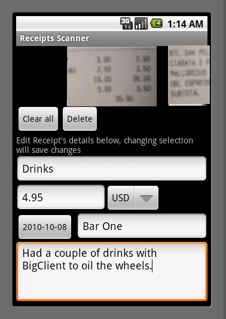
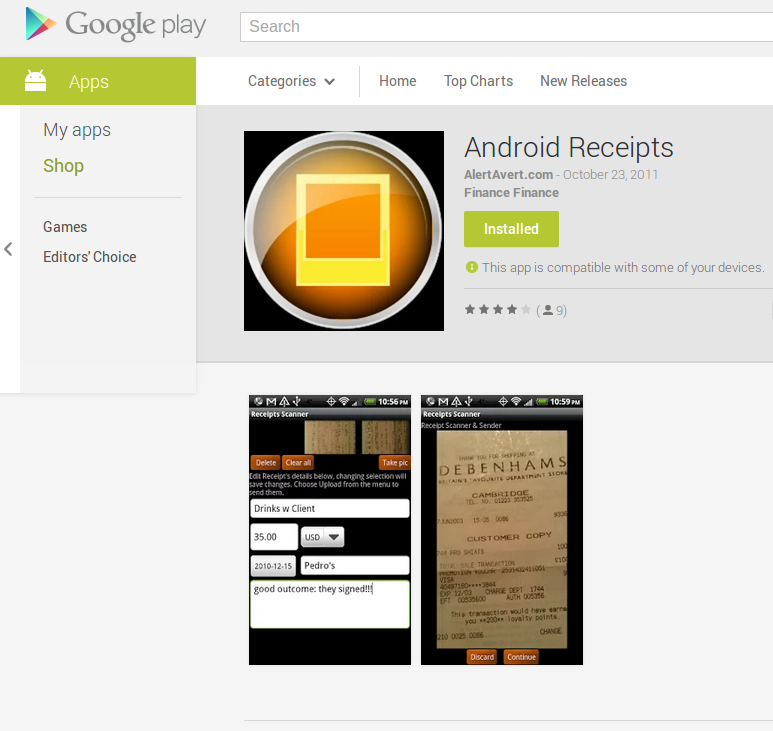

========================
ReceiptScan -- Use Cases
========================

:Created by: M. Massenzio, m.massenzio@gmail.com
:Created on: 2010-04-13
:Last Updated: 2010-05-31

Objective
---------

A simple Android app to allow user to scan a number of expense receipts, optionally store them on the phone and then send them to an email accout of choice; either immediately, or at a later stage.

Additional scope: create a server-based backend to store and retrieve receipts, manage expenses and, eventually, connect to the expense reporting API (if/where available).

Published to Android Market, 2011

UseCase 1 -- User Scans Receipts
--------------------------------

Primary actor: User (U)
Scope: SuD
Level: summary

1. U starts up app
2. SuD shows camera view 
3. U focuses and then takes a snap (long-press)
4. SuD snaps the shot and shows Preview (P) to U
5. U accepts P
6. SuD stores P, shows again camera view
7. back to step 3.

::

    completed 2010-04-29, rel. alpha (0.1)

UseCase 2 -- User Uploads Receipts
----------------------------------

Primary Actor: U
Scope: SuD
Level: summary

1. U clicks on 'Send' icon/button
2. SuD checks for destination email to be present
3. SuD finds dest email, asks user to confirm it is the desired one
4. U accepts
5. SuD attempts to send email
6. send succeeds; SuD notifies U

::

    completed 2010-04-29, rel. alpha (0.1)

UseCase 3 -- User sets up Destination Email
-------------------------------------------

Primary Actor: U
Scope: SuD
Level: summary

1. U selects the 'Settings' option
2. SuD shows a 'Preferences' screen, w/ a text input available for destination email
3. U types in new email address, clicks on 'Ok' button (alternative: Pref's have a 'Save' option)
4. SuD performs basic syntax check (presence of @, dot.notation for server, etc.)
5. new email address is stored for future use

::

    completed 2010-05-11, rel. beta (0.2)

UseCase 4 -- System recovers images from previous session
---------------------------------------------------------

Primary Actor: SuD
Scope: SuD
Level: summary

1. SuD gets started / resumed
2. SuD scans receipts images default storage location for image files
3. SuD matches in-memory Receipt objects' names w/ image files' names
4. if files exist that don't match Receipt objects' names, new Receipt objects are created and associated with images
    4.a (optional) U is prompted to whether these ought to be retained or discarded
    4.b (optional) U is allowed to choose for items individually (eg. checkbox 'save' for each)
5. SuD saves/discards as instructed

::

    in progress: completed 2010-05-24 (w/o optional parts)

UseCase 5 -- User selectively edits receipts' details
-----------------------------------------------------

Scope: SuD
Level: summary

1. User selects "Preview Images"
2. SuD display images gallery
3. User selects one image from gallery
4. SuD displays associated metadata (name, associated Expense report, date, enlarged image, notes)
    5.a User can choose to Delete receipt
        5.a.1 SuD removes receipt from gallery & deletes image from storage
    5.b User is allowed to Edit receipts detail
        5.b.1 SuD display "Edit receipt detail" page
        5.b.2 User makes edits, then can either Save / Cancel
    5.c User is allowed to "Retake Picture"
        5.c.1 SuD retain receipt's metadata, but goes into Preview mode and enables User to snap another picture
        5.c.2 User is allowed to Save / Retake / Cancel

::

    in progress: 2010-05-31 receipt's name edit (beta_0.3)

